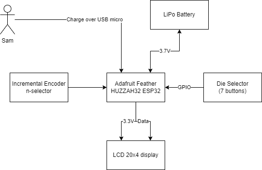

# DiceTower - A 3D-Printed Electronic Dice Tower

View this project on [CADLAB.io](https://cadlab.io/project/27312).

## System Architecture Diagram

## Bill of Materials

| Item                                   | Quantity | Price (Estimated) | Link                                  |
| -------------------------------------- | -------- | ----------------- | ------------------------------------- |
| ESP32 Feather Huzzah32                 | 1        | $20.22            | [DigiKey-ESP32]                       |
| LCD 20x4                               | 1        | $20.26            | [DigiKey-LCD]                         |
| PCB                                    | 1        | $5.00             | [PCBWay]; [JLCPCB]                    |
| 3D-Printed Parts                       | 1        | $10.00            |
| Incremental Encoder                    | 1        | $1.00             | [TinyTronics-Encoder]                 |
| Encoder Knob                           | 1        | $1.00             | [TinyTronics-Encoder-Knob]            |
| Dice (d4, d6, d8, d10, d12, d20, d100) | 1        | $10.00            |
| Switches                               | 7        | $9.99             |
| Dice keycaps printed                   | 7        | $1.00             |
| Boost Converter                        | 1        | $2.00             | [TinyTronics-Boost-Converter]         |
| Battery                                | 1        | $5.00             | [TinyTronics-Battery]                 |

[DigiKey-ESP32]: https://www.digikey.nl/en/products/detail/adafruit-industries-llc/3619/8119806
[DigiKey-LCD]: https://www.digikey.nl/en/products/detail/newhaven-display-intl/NHD-0420AZ-FSW-GBW-33V3/2773596
[PCBWay]: https://www.pcbway.com
[JLCPCB]: https://jlcpcb.com
[TinyTronics-Encoder]: https://www.tinytronics.nl/shop/nl/schakelaars/manuele-schakelaars/rotary-encoders/rotary-encoder-module
[TinyTronics-Encoder-Knob]: https://www.tinytronics.nl/shop/nl/componenten/knoppen,-doppen-en-kapjes/potmeter-knop-zwart
[TinyTronics-Boost-Converter]: https://www.tinytronics.nl/shop/en/power/voltage-converters/boost-(step-up)-converters/mini-dc-dc-3.3v-step-up-boost-converter-400ma
[TinyTronics-Battery]: https://www.tinytronics.nl/shop/en/power/batteries/li-po/li-po-battery-3.7v-1250mah-jst-ph-lp554050
